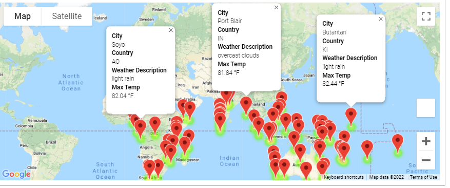
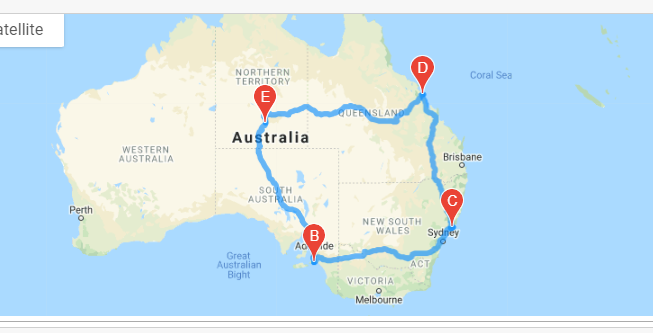
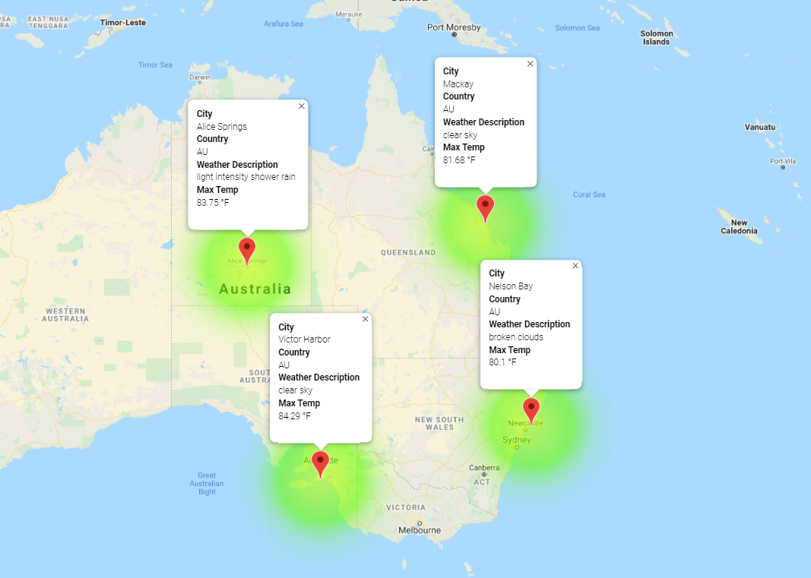

# World_Weather_Analysis

## Summary
The purpose of this project was to use APIs to collect data for cities.

### Weather_Database
- Generate a set of 2,000 random latitute and longitudes of cities in the world
- Use an API call with OpenWeatherMap to gather city weather data

### Vacation_Search
- Use input statements to retrieve customer weather prefereneces (i.e., find out what max/min temperature of a city the input user prefers)
- Use these preferences to identify potential travel destinations that match the criteria, as well as find nearby hotels to these destinations
- Create a map with pop-up markers using Google Maps APIs

 

### Vacation_Itinerary
- Use Google Directions API to create travel itinerary that shows the route on a map between 4 cities chosen from the customer's possible travel destinations (found in Vacation_Search)

 

- Create a map with pop-up markers for each city on the itinerary

 